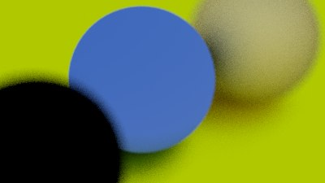

# [Ray Tracing in One Weekend](https://raytracing.github.io/books/RayTracingInOneWeekend.html) with Rust (4.0.1 book version)

Run code:
```
cargo r --release > image.ppm
```

You can view an image with any online .ppm reader. Or use [this one](https://www.cs.rhodes.edu/welshc/COMP141_F16/ppmReader.html).

`❗There is an bug with the dielectric material. I would be very grateful if you could help me with this.`

With Schlick approximation (Irregular reflections and no hollow sphere effect):  


Without Schlick approximation (Complete absence of reflections and transparency, dark sphere):  
